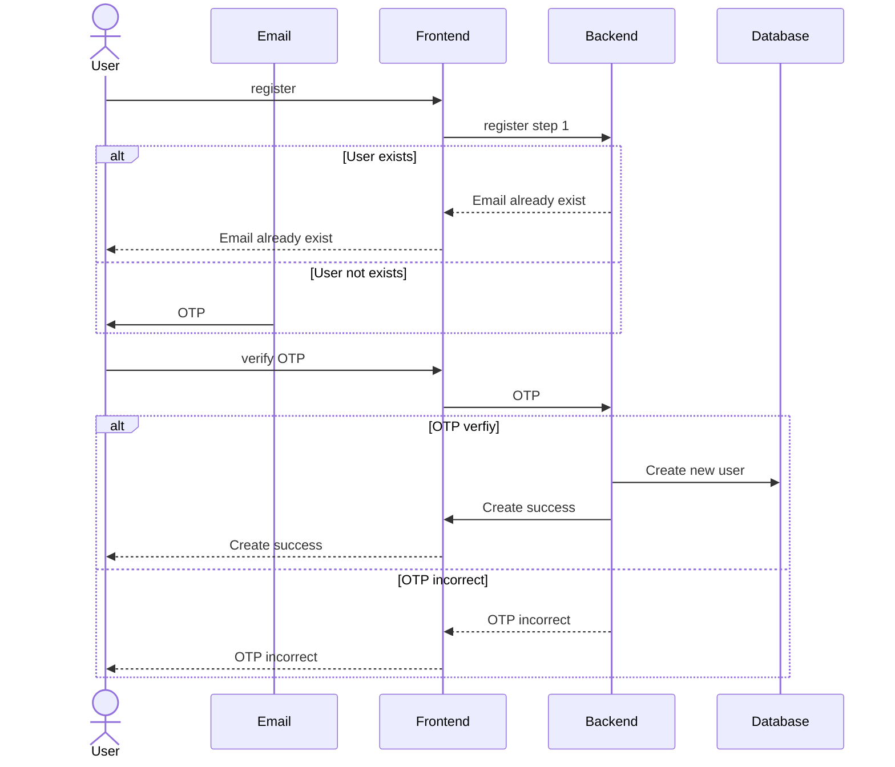
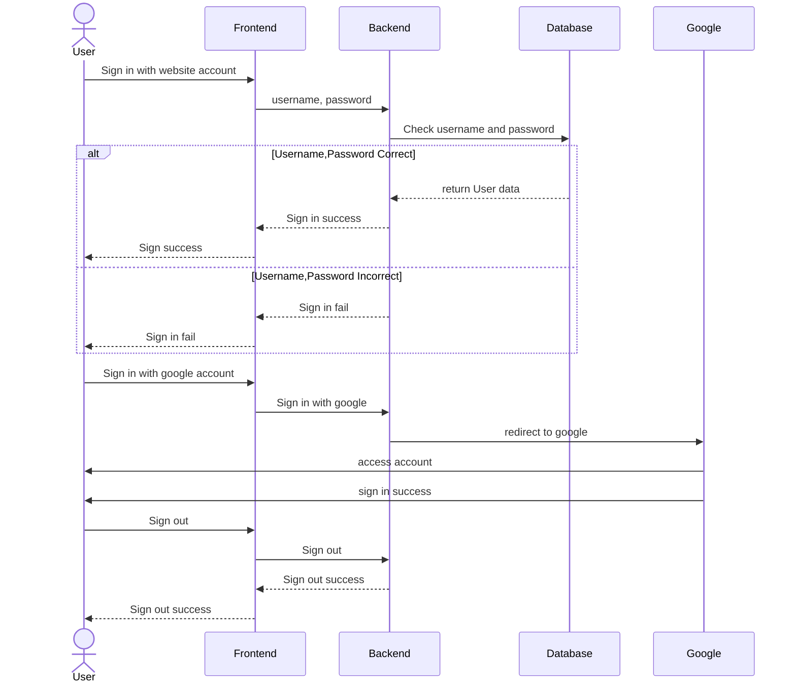
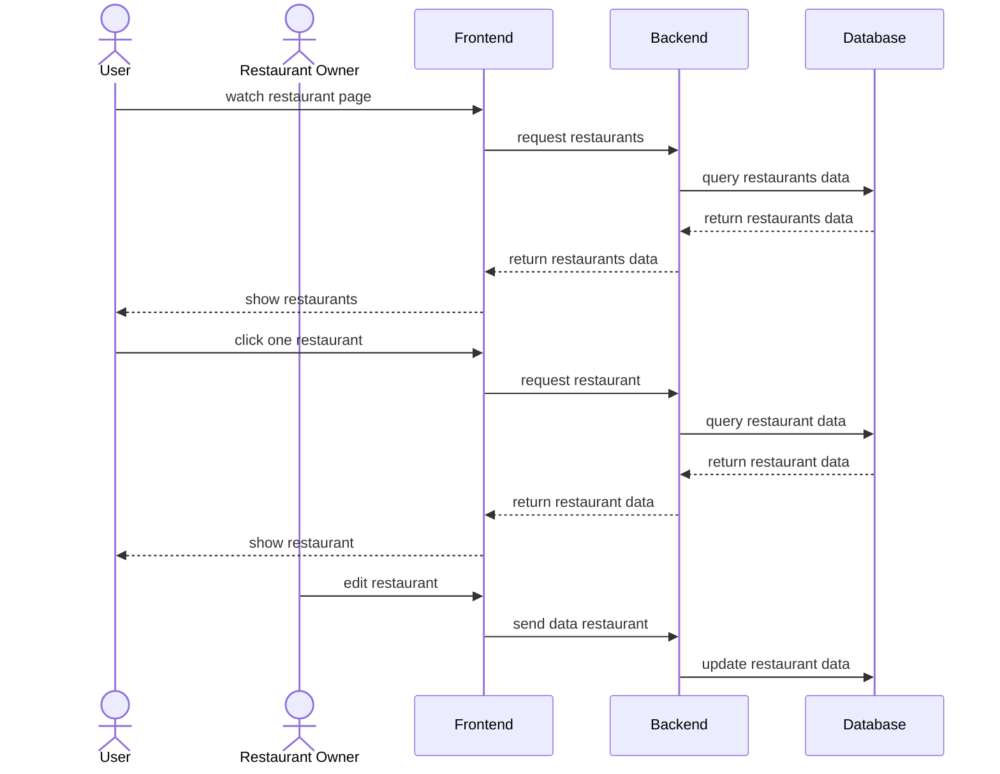
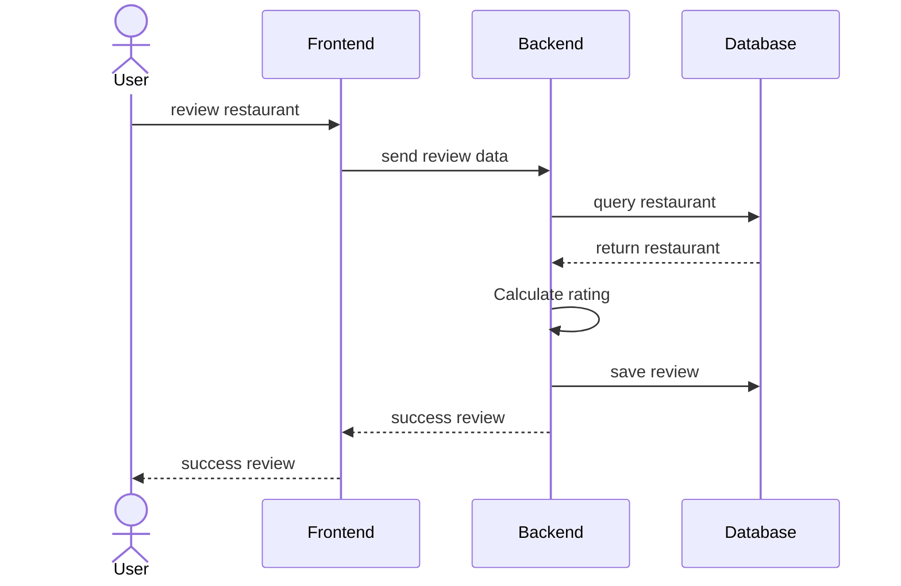

# Review Restaurant

## this project is review restaurant around KMITL PCC

A full-stack web application for restaurant reviews.

## Project Structure

- **frontend/** – React Router + Vite + TailwindCSS frontend
- **backend/** – Express.js TypeScript backend API

## Features

- Modern React frontend with server-side rendering
- TailwindCSS for styling
- Express.js backend API
- TypeScript throughout
- Docker support for both frontend and backend

## Getting Started

### Prerequisites

- Node.js (v18+ for backend, v20+ for frontend recommended)
- npm

### Installation

Install dependencies for both frontend and backend:

```sh
cd backend
npm install

cd ../frontend
npm install
```

### Development

#### Backend

```sh
cd backend
npm run dev
```

#### Frontend

```sh
cd frontend
npm run dev
```

- Frontend: http://localhost:5173
- Backend: http://localhost:3000

### Building for Production

#### Backend

```sh
cd backend
npm run build
```

#### Frontend

```sh
cd frontend
npm run build
```

### Docker

You can build and run both frontend and backend using Docker:

#### Frontend

```sh
cd frontend
docker build -t review-restaurant-frontend .
docker run -p 3000:3000 review-restaurant-frontend
```

#### Backend

```sh
cd backend
docker build -t review-restaurant-backend .
docker run -p 3000:3000 review-restaurant-backend
```

## Sequence Diagram

### Authentication

#### Sign Up



#### Sign In, Sign Out



### Restaurant



### Review



## License

MIT

---

Built with ❤️ using React, Express, and
